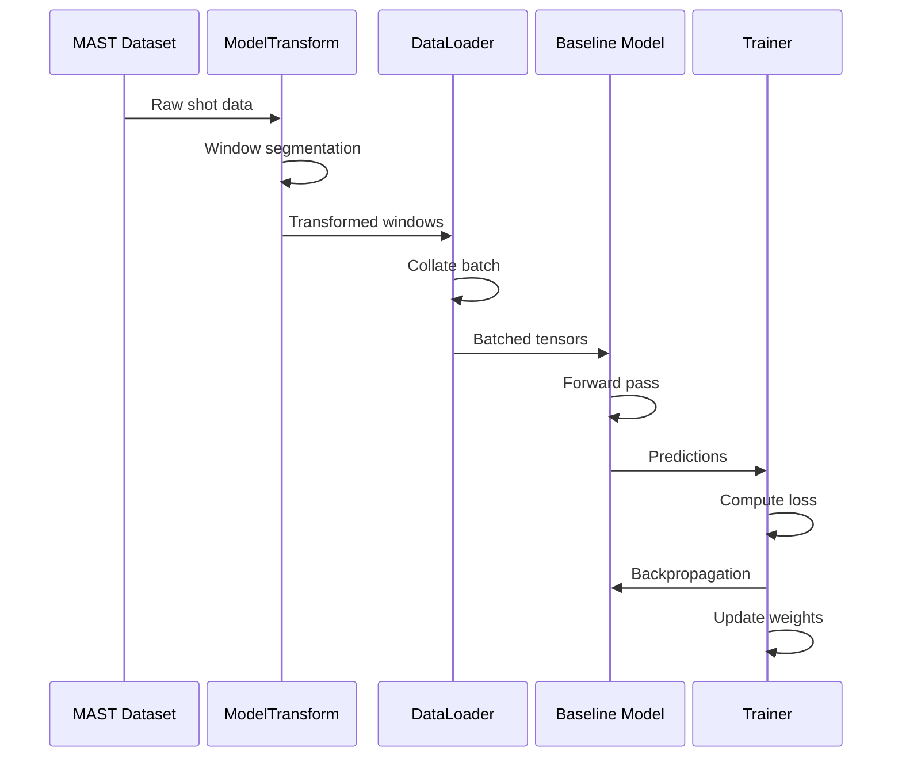

# TokaMark Baseline

This is a **deep learning baseline** for the **TokaMark benchmark**, which focuses on fusion plasma prediction tasks using the MAST (Mega Ampere Spherical Tokamak) dataset. The architecture implements a multi-branch CNN encoder-decoder model for time-series prediction.

The code in this repository corresponds to the official implementation of the **TokaMark (CNN) baseline model** introduced in the 
paper [TokaMark: A Comprehensive Benchmark for MAST Tokamak Plasma Models](https://arxiv.org/abs/2602.10132).

Companion resources:
* <ins>**TokaMark:**</ins> A Python-based system for preprocessing fusion plasma data from the MAST (Mega Ampere Spherical 
Tokamak) facility and providing benchmark tasks for machine learning models.

## Environment Setup

1. Install this baseline repository and switch to **Neurips branch**:

```bash
git clone --branch neurips-code --single-branch https://github.com/UKAEA-IBM-STFC-Fusion-FMs/tokamark_baseline.git
cd tokamark_baseline
```

2. Create and activate the required Conda environment and install the preprocessing packages from the **TokaMark** repository:

```bash
git clone --branch neurips-code --single-branch  https://github.com/UKAEA-IBM-STFC-Fusion-FMs/tokamark.git
cd tokamark
conda env create -f environment_basic.yml
conda activate tokamark-env
pip install -e .
```

3. Install required **TokaMark Baseline** dependencies:
```bash
pip install line-profiler==5.0.2 torchinfo==1.8.0
```

## Download Sample Data

To download the required sample dataset, run the provided Jupyter notebook:
```bash
cd tokamark_baseline
jupyter notebook download_tokamark_sample_data.ipynb
```

## Usage

### Training
```bash
python run_training.py --task task_1-1 --config_cnn /src/config/config_model_test.yaml --seed 23
```

### Evaluation
```bash
python run_evaluation.py --task task_1-1 --config_cnn /src/config/config_model_test.yaml --seed 23
```

## High-Level Architecture Overview

```mermaid
graph LR

%% -------------------------
%% DATA PIPELINE (bottom → top)
%% -------------------------
subgraph "Data Pipeline"
    direction BT
    A[MAST Dataset] --> C[Data Preprocessing]
    C --> D[DataLoader with Collation]
end

%% -------------------------
%% MODEL ARCHITECTURE
%% -------------------------
subgraph "Model Architecture"
    direction BT
    E[Multi-Branch Encoder] --> F[Backbone Network]
    F --> G[Multi-Branch Decoder]
    G --> H[Predictions]
end

%% -------------------------
%% TRAINING & EVAL
%% -------------------------
subgraph "Training & Evaluation"
    direction BT
    I[MultiOutputMSELoss] --> J[BatchStepTrainer]
    J --> L[Evaluator]
end

%% -------------------------
%% CROSS-BLOCK FLOW (bottom → top feel)
%% -------------------------
D --> E
H --> I

%% -------------------------
%% STYLING
%% -------------------------
style A fill:#e1f5ff
style E fill:#ffe1e1
style F fill:#ffe1e1
style G fill:#ffe1e1
style J fill:#e1ffe1
```



## Core Components

### 1. **Entry Points** (`run_training.py` & `run_evaluation.py`)

These scripts orchestrate the entire pipeline:

- **Training**: Initializes datasets, creates model architecture, and runs batch-step training
- **Evaluation**: Loads trained models, performs inference, and computes metrics

Key configuration:
- Task selection (e.g., `task_1-1`)
- CNN configuration via YAML files
- Seed management for reproducibility

### 2. **Data Transformation** (`src/model_transform.py`)

The `ModelTransform` class prepares data for the CNN:

```python
# Transforms raw data into structured format:
{
    'input': [input_signals],           # Model inputs
    'exogenous': [actuator_signals],    # Actuators
    'y': [output_signals]               # Prediction targets
}
```

**Key features:**
- Handles temporal windowing for Markovian vs non-Markovian tasks
- Chunk input and actuator signals into 5ms windows

### 3. **Encoder-Decoder Architecture** (`src/conv_encoders_decoders.py`)

**Encoder Types:**
- **`Conv1DEncoder`**: For time series (shape: `[channels, time]`)
- **`Conv2DEncoder`**: For profiles over time (shape: `[channels, time, height]`)
- **`Conv3DEncoder`**: For images over time (shape: `[channels, time, height, width]`)

**Decoder Types:**
- **`Conv1DDecoder`**: Reconstructs 1D outputs
- **`Conv2DDecoder`**: Reconstructs 2D profiles
- **`Conv3DDecoder`**: Reconstructs 3D volumes

**Backbone:**
- MLP-based: 3-layer MLP with dropout (0.2)
- LSTM-based: seq2seq LSTM that encodes multimodal spatiotemporal inputs into a latent hidden state and decodes future trajectories conditioned the exogenous encoded state

**Architecture Details:**
- Each encoder compresses inputs to a fixed dimension `D` (default: 16)
- Backbone network: 3-layer MLP with dropout (0.2)
- Uses gradient checkpointing to reduce memory usage
- Supports heterogeneous input/output shapes

### 4. **Training System** (`src/trainer.py`)

#### Batch-Step Training

The `BatchStepTrainer` implements incremental training:

```python
# Training loop structure:
while trainer.step_batch():
    # Single batch update
    # Validation every N batches
    # Early stopping check
```

**Key Features:**
- **`MultiOutputMSELoss`**: Handles multiple output branches
- **`cnn_collate_fn`**: Custom collation with NaN handling
- **Validation frequency**: Configurable (default: every 100 batches)
- **Early stopping**: Based on validation loss with patience
- **Optimizer**: Adam with weight decay (1e-4)
- **History tracking**: Saves training/validation loss per step

### 5. **Evaluation System** (`src/evaluator.py`)

Two main evaluation functions:

#### `cnn_unstd_evaluation_per_shot`
- Unstandardizes predictions using saved mean/std
- Computes metrics per window and feature
- Uses `WindowMetricsAccumulator` from MAST benchmark

#### `cnn_safety_vizu_per_shot`
- Generates visualizations for first N shots
- Handles different output dimensionalities (1D, 2D, 3D, 4D)
- Creates comparison plots (true vs predicted)

### 6. **Utilities** (`utils.py` & `globals.py`)

- **`set_seed()`**: Ensures reproducibility across Python, NumPy, PyTorch
- **`seed_worker()`**: Seeds DataLoader workers
- **`globals.py`**: Manages repository paths dynamically

## Data Flow



## Memory Optimization

The architecture employs several memory-saving techniques:

1. **Gradient Checkpointing**: Used in encoder/decoder forward passes
2. **Mixed Precision**: Configurable (commented out in current version)
3. **Batch Size Management**: Configurable via YAML
4. **Pin Memory**: Enabled for faster GPU transfer
5. **Worker Processes**: Multiprocessing for data loading

## Configuration Files

Located in `src/config/`:
- `config_model_test.yaml`: Quick testing configuration
- `config_model.yaml`: Production configuration

Configuration includes:
- Training settings (learning rate, max steps, patience)
- DataLoader settings (batch size, workers)
- Path configurations

## Dependencies

The system integrates with the **tokamark** package for:
- Dataset initialization
- Task configuration
- Metric computation
- Data splitting (train/val/test)

## Architecture Summary

This architecture provides a flexible, scalable baseline for fusion plasma prediction tasks with support for heterogeneous multi-modal time-series data. The multi-branch design allows the model to process different types of diagnostic signals (1D time series, 2D profiles, 3D images) simultaneously and produce predictions in various formats matching the physical quantities of interest.

## Companion Resources

| Resource | Link |
|---|---|
| TokaMark paper | [arXiv:2602.10132](https://arxiv.org/abs/2602.10132) |
| TokaMark repository | [UKAEA-IBM-STFC-Fusion-FMs/tokamark](https://github.com/UKAEA-IBM-STFC-Fusion-FMs/tokamark) |

## Citing TokaMark

A preprint version of the manuscript is available [here](https://arxiv.org/abs/2602.10132).

If you use TokaMark, please cite our work as:

    @article{rousseau2026tokamark,
      title={TokaMark: A Comprehensive Benchmark for MAST Tokamak Plasma Models},
      author={
        Rousseau, C{\'e}cile and Jackson, Samuel and Ordonez-Hurtado, Rodrigo H. and
        Amorisco, Nicola C. and Boschi, Tobia and Holt, George K and Loreti, Andrea and 
        Sz{\'e}kely, Eszter and Whittle, Alexander and Agnello, Adriano and Pamela, Stanislas and 
        Pascale, Alessandra and Akers, Robert and Bernabe Moreno, Juan and Thorne, Sue and 
        Zayats, Mykhaylo
      },
      journal={arXiv preprint arXiv:2602.10132},
      year={2026}
    }